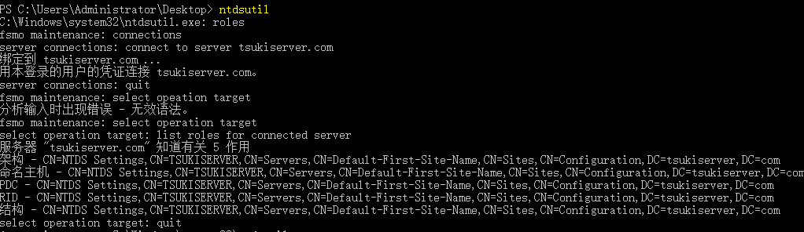
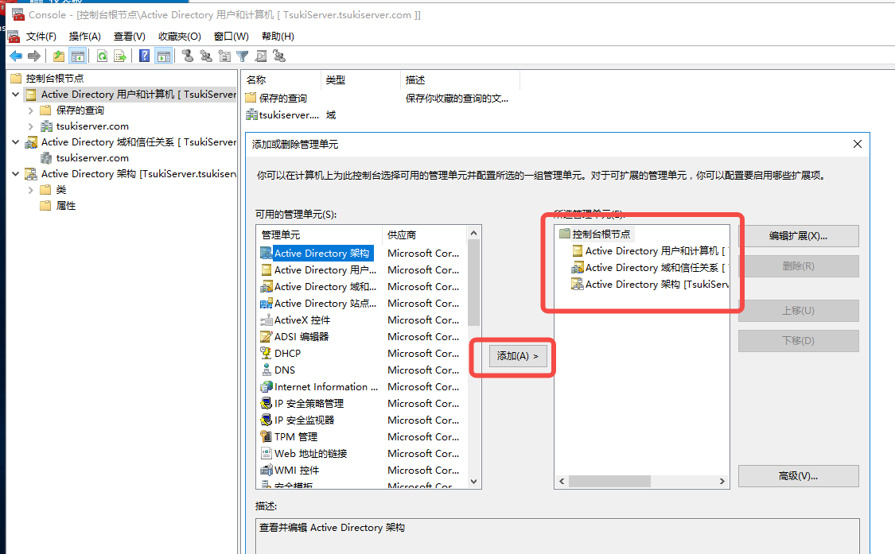

# AD域的一些基本工具

今天的话主要是学习五个内容：

1. fsmo 角色
2. ntdsutil 工具
3. AD 数据的复制方式
4. DNS 的工作逻辑
5. 子网与站点 的工作逻辑

这五样内容实际上是环环相扣的，**站点与子网** 定义了网络的物理结构，**DNS** 提供了名称解析与定位服务，**KCC** 根据站点拓扑自动构建复制路径，**FSMO** 角色在复制之外确保关键操作的唯一性，而 **ntdsutil** 则是这一切的底层维护工具。

同时，为了方便查阅，在文章的开头先列出一些常用的缩写便于查阅：

| 缩写 | 全称 | 中文 | 说明 |
| :--- | :--- | :--- | :--- |
| **DC** | Domain Controller | 域控制器 | 存储 AD 数据库的核心服务器 |
| **DN** | Distinguished Name | 可分辨名称 | 对象在目录树中的完整路径 |
| **FQDN** | Fully Qualified Domain Name | 完全限定域名 | 带域名的完整主机名 |
| **AD** | Active Directory | 活动目录 | 整个域服务的统称 |
| **OU** | Organizational Unit | 组织单位 | 域中的容器，用于分组管理 |
| **RDN** | Relative Distinguished Name | 相对可分辨名称 | DN 中的单个组成部分 |
| **GPO** | Group Policy Object | 组策略对象 | 集中管理用户和计算机配置 |
| **SID** | Security Identifier | 安全标识符 | 每个安全主体的唯一 ID |

## 1. AD 域的安装

那么首先，就从 AD 域的安装开始吧！那么首先，在服务器管理的 Dashboard 安装 AD DS吧！

顺带着装一下 DNS 与 DHCP，稍后提升至域控制器也需要用到。

最后就在 Active Directory 域服务 里将服务器添加为域控制器吧！

记得是从新林开始创建，因为一开始是没有域的！

## 2. FSMO 角色

### 2.1 FSMO 角色介绍

FSMO 角色一共五种，分别处理不同的功能。这五种角色按作用范围分为两类：**林级别（整个林只有一个）**和**域级别（每个域各有一套）**。

1、**架构主机 (Schema Master)**：范围 **林**，负责修改 AD 架构（如添加新对象类或属性）。比如，当需要部署 Exchange 等需要扩展 AD 架构的新应用时，就必须连到它。如果不可用，将无法对架构进行任何变更。
 
2、**域命名主机 (Domain Naming Master)**：范围 **林**，管理林中域的添加与删除。如果不可用，将无法s在林中创建或删除任何域。

3、**RID 主机 (RID Master)**：范围 **域**，分配 RID 池，确保安全主体 SID 唯一。如果不可用，当域控用尽本地 RID 池后，将无法创建新的安全主体。

4、**DC 模拟器 (PDC Emulator)**：范围 **域**，**最活跃的角色**，处理密码更改、账户锁定和时间同步。同时也是最重要的角色，对性能影响最大。如果不可用，用户修改密码后可能会遇到登录问题。

5、**基础结构主机 (Infrastructure Master)**：范围 **域**，维护跨域对象引用的完整性。例如，当 A 域的组包含 B 域的用户，而该用户被移动或重命名时，由它来更新组里的引用。在多域环境中很重要。若所有域控都是全局编录服务器，则此角色几乎用不上。

此五个角色可以使用 ntdsutil 工具进行查看。管理员身份打开 cmd 后进入 powershell，而后使用 ntdsutil 工具即可：

```powershell
roles
connections
connect to server <domain.com>
quit
select operation target
list roles for connected server
```


就可以查看到五个角色的类型了。

### 2.2 FSMO 的查看与管理

可以通过 GUI 方式查看，当然，使用 Powershell 更加快速高效。

#### 2.2.1 通过 GUI 方式进行查看

**林级别角色（架构主机、域命名主机）**：需要在 MMC 控制台里添加对应的管理单元。要查看架构主机，需要先用 regsvr32 schmmgmt.dll 注册一下。

**域级别角色（RID 主机、PDC 模拟器、基础结构主机）**：在 “Active Directory 用户和计算机” 中，右键点击你的域，选择“操作主机”，即可通过三个标签页分别查看和转移。

使用 cmd 打开 mmc 控制台，点击**文件**，选择**添加/删除管理单元**。在弹出的**添加或删除管理单元**对话框中，点击**添加**按钮。而后添加需要的管理单元即可。



#### 2.2.2 通过 Powershell 方式进行查看

1、查看林级别角色（**Get-ADForest** 方法）

```powershell
Get-ADForest | fl SchemaMaster, DomainNamingMaster
```

2、查看域级别角色（**Get-ADDomin** 方法）

```powershell
Get-ADDomain | fl RIDMaster, PDCEmulator InfrastructureMaster
```

#### 2.2.3 使用 ntdsutil 工具

使用：ntdsutil → roles → connections → connect to server 目标DC名 进入管理界面。用 transfer 或 seize 命令来转移或强行占用角色。在前文中已经讲了具体的操作方法，此处不再赘述。

#### 2.2.4 管理操作：转移 (Transfer) 和强行占用 (Seize)

**转移 (Transfer)**：用于**计划内维护**，比如你想把角色从一台 DC 移到另一台性能更好的 DC 上。此时，原角色持有者在线且健康。

**强行占用 (Seize)**：用于**灾难恢复**。当角色持有者永久离线且无法恢复时，你需要在另一台健康的 DC 上强行占用该角色。

强行占用是紧急操作，必须小心使用。 强行占用后，原来的角色持有者永远不能再重新上线，否则会造成严重的冲突。

#### 2.2.4 附加内容

1、如果承载 PDC 模拟器角色的域控制器突然宕机且无法恢复，要如何处理？

首先，需要判断这台 DC 确实无法恢复。而后，选择一台健康的、性能较好的域控制器，使用 `ntdsutil` 或 `PowerShell` 的 `Move-ADDirectoryServerOperationMasterRole -Force` 命令来强行占用 (Seize) `PDC 模拟器`角色。

完成占用后，用 `netdom query fsmo` 或 `Get-ADDomain | fl PDCEmulator` 验证角色已转移。

最后，在`原故障 DC` 上执行`元数据清理 (Metadata Cleanup)`，将它从 AD 中彻底移除，防止它未来恢复上线时造成冲突。

## 3. ntdsutil 工具

第二节既然提到了 ntdsutil 工具，那么本节就来详细展开讲讲这个非常有用的管理和故障排除的核心工具。

### 3.1 元数据清理 (Metadata Cleanup)

当一台域控制器因硬件故障、系统崩溃等原因被强制下线且无法恢复时，它在 AD 中的信息（元数据）会成为残留。必须手动清理这些残留数据，否则可能导致复制冲突和其他问题。

相关步骤：
```powershell
ntdsutil # 1. 打开 ntdsutil 工具
metadata cleanup # 2. 进入元数据清理的菜单
connections # 3. 创建链接
connect to server <正常DC的FQDN> # 4. 连接一台正常的域控制器
quit # 5. 连接成功后，准备返回执行元数据清理的菜单

# 执行元数据清理
select operation target # 列出子菜单

list sites # 列出站点的编号
select site <site> # 选择站点编号

list domains # 列出目标域的编号
select domain <domain> # 选择目标域

list server in site # 找到失效的服务器
select server <server> # 选择失效的服务器编号 

remove selected server # 删除服务器

# 通常来说，这里的选择编号都是获得结果前面的那个数字编号，例如 "0"
```

### 3.2 FSMO 角色管理

用于 **转移 (Transfer)** 或 **强行占用 (Seize)** FSMO 角色。

先前也提到过，转移就是在计划内维护中，将角色从一台 DC 平稳地移到另一台。但强行占用是紧急操作，一旦执行，原角色持有者绝不能再次上线。

继上文 2.2.4 的问题，在这里给出详细的实现方案：

```powershell
ntdsutil # 启动工具
roles # 进入角色页面
connections # 建立连接
connect to server <FQDN> # 连接到目标服务器
quit # 返回

fsmo maintenance # 进入FSMO操作菜单
# 根据需要，选择对应功能
transfer PDC # 转移PDC
seize PDC # 强行占用PDC
```
也可以使用 `seize RID master`（占用角色：RID主机，强行接管RID池分配权）、`seize infrastructure master`（占用角色：基础结构主机，强行接管跨域对象引用更新权）、`seize schema master`（占用角色：强行接管 AD 架构修改权）、`seize naming master`（占用角色：域命名主机，强行接管林中域的添加/删除权） 等命令处理其他角色。

最后，可以在 Powershell 中，使用 `netdom query fsmo` 查看角色归属。

### 3.3 数据库维护

用于维护 AD 数据库文件 ntds.dit。它有两大核心操作：

1、**离线碎片整理 (Defragmentation)**：压缩数据库文件，回收空间。需在“目录服务还原模式”下或停止 AD DS 服务后执行。这个过程会创建一个全新、无碎片、体积可能更小的数据库文件副本。它不仅能释放磁盘空间，还能重建所有索引，提升数据库的整体性能。

2、**完整性检查 (Integrity Check)**：检查数据库文件是否损坏。这通常是在出现 AD 相关报错或怀疑数据库损坏时，进行故障排查的第一步。

#### 3.3.1 ntds.dit

ntds.dit 是一个数据库，它存储了 AD 中有关用户对象、组和组成员的信息。位置一般在 C:\Windows\NTDS\ntds.dit，由系统锁定，平时无法直接读取。‌‌

如果需要使用 ntdsutil 工具进行绑定访问，则在此之前需要先停止 AD 服务。使用 `net stop ntds`进行停止。当然，在操作前请一定**备份系统状态**。在处理完毕后使用 `net start ntds` 重启服务。

相关命令如下：

```powershell
ntdsutil # 进入工具界面
activate instance ntds # 绑定数据库
files # 进入文件维护模式
info # 可查看当前数据库路径与大小
```
#### 3.3.2 离线碎片整理 & 完整性检查

AD 在运行时会被 NTDS 服务锁定，因此需要重启服务器进入 DSRM（Directory Services Repair Mode） 模式。也就是启动服务器的时候按 F8 选择 DSRM 模式，使用 DSRM 的管理员密码即可进入。

而后就可以使用上文的命令对数据库文件进入操作了。

续接上文，离线碎片整理即压缩数据库文件后进行存放，使用 `compact to <指定绝对路径>` 即可。碎片整理完成后，会生成一个新的 ntds.dit 文件在指定的目标文件夹里。而后不要忘记在 Powershell 中，使用新的文件覆盖旧的文件（copy）。

完整性检查只需要在进入文件维护模式之后，使用 `integrity` 方法即可进行完整性检查。

服务器重启后，建议运行以下命令检查 AD 健康状态。

```powershell
dcdiag # 检查域控制器整体健康状况
repadmin /replsummary # 检查 AD 复制状态
```

### 3.4  快照管理

可以在线创建 AD 数据库的时间点副本（即 快照）。可以查看其中的数据以恢复被误删除的对象。操作步骤如下：

```powershell
ntdsutil # 启动工具
snapshot # 启动快照模式
activate instance ntds # 绑定 ntds
create # 创建快照，并返回一个 GUID
mount <GUID> # 挂载快照
```

挂载后会生成一个类似 C:\$SNAP_... 的路径，可以在其中浏览 AD 数据库的副本。

### 3.5 其它重要功能

这里简单列出一些功能，当然远不止这些：

IFM (媒体安装文件)：创建用于安装额外域控制器的安装媒体 (ifm)。

重置 DSRM 密码：在忘记目录服务还原模式密码时，可用于重置 (set DSRM password)。

授权还原 (Authoritative Restore)：在域控制器系统状态还原后，将特定对象标记为“权威”版本并复制到整个林 (authoritative restore)。

## 4. AD 数据复制方式

AD 的数据复制方式，核心是**多主机复制模型**，所有**域控制器**地位平等。系统通过**站点和网络连接**来优化复制效率和带宽。主要的复制方式可以分为两类：**站点内复制**和**站点间复制**。


| 复制方式 | 特点 | 操作 | 适用场景 |
| :--- | :--- | :--- | :--- |
|站点内复制 (Intra-site)|高速、即时，利用变更通知机制。源DC有更新后，等待约15秒便会通知其复制伙伴。数据不压缩，追求最短的收敛时间。|无需手动配置，由KCC自动生成环形拓扑和连接对象|位于同一局域网（LAN）或高速链路的DC|
|站点间复制 (Inter-site)|按计划、节省带宽，按预设间隔进行（默认180分钟）。数据压缩后再传输，以节省广域网带宽|需手动配置站点链接（Site Link），并设置其复制频率和成本（Cost）。可指定桥头服务器（Bridgehead Server）代表站点通信|跨广域网（WAN）或不同地理位置的DC|

两种复制的核心差异在于，站点内靠“变更通知”，更新后**几乎立即复制**；站点间靠“定时计划”，按**配置的时间表**进行。且站点内**不压缩以节省CPU**；站点间压缩以**节省带宽**。拓扑结构上，站点内由KCC自动构建；站点间需通过站点链接配置，形成生成树拓扑。

### 4.4.1 Repadmin 核心命令行工具

在拥有多个域控制器的网络环境中，保持所有域控制器上的AD数据同步至关重要。Repadmin 就是用来确保这一同步过程的工具

核心用法如下：

```powershell
repadmin /replsummary
# 快速生成整个AD环境的复制状态摘要
# 显示成功/失败的复制次数和最大的复制延迟

repadmin /showrepl
# 显示指定域控制器的详细复制状态
# 包括其复制伙伴、上次复制尝试的时间和结果

repadmin /syncall
# 强制指定的域控制器与它的所有复制伙伴进行同步

repadmin /replicate
# 强制将一个特定的目录分区（如架构、配置或域分区）从一个域控制器复制到另一个指定的域控制器

repadmin /queue
# 检查复制队列(是否有积压)

repadmin /kcc
# 强制触发域控制器上的KCC（知识一致性检查器） 立即重新计算其入站复制拓扑

repadmin /showobjmeta
# 显示一个特定对象（如用户或组）的复制元数据
# 包括该对象的属性是由哪个域控制器、在什么时间修改的

repadmin /removelingeringobjects
# 用于移除“残留对象”，这些是已被删除但仍在某些域控制器上残留的对象，可能会引发复制错误
```

看着很多很复杂，实际上是有对应的使用场景的：

| 要做的事情 | 对应机制/工具 |
|---|---|
| 加一台新 DC 进域 | 全量复制 + KCC 自动建立复制拓扑 |
| 改完组策略/用户，想让全公司立刻生效 | 手动 `repadmin /syncall` + 客户端 `gpupdate /force` |
| 查"密码改了为啥另一台登录不认" | `repadmin /showrepl` 查看复制伙伴、上次复制时间与状态 |
| 发现某 DC 复制长期失败 | `repadmin /replsummary` 汇总全网健康状态 |
| 两台 DC 同时改了同名对象 | AD 冲突解决机制(按版本/时间戳裁决)自动处理，必要时查冲突对象 |
| 判断复制是否有积压、延迟多大 | `repadmin /queue`、`repadmin /showvector /latency` |
| 一台 DC 彻底损坏且无法恢复 | `ntdsutil` 元数据清理 + 必要时 `seize` 强占 FSMO 角色 |
| 分公司/远程站点同步异常 | 检查站点链接复制间隔、桥头服务器、防火墙 135/动态端口 |

同时在最后补充一下 KCC 的概念，KCC 是**知识一致性检查器**，是AD的一个内置进程，它自动在所有域控制器之间创建和调整复制拓扑。在站点内，它生成一个高效的环形拓扑；在站点间，它根据站点链接的成本，为每个目录分区生成一个成本最低的生成树拓扑。每 15 分钟，自动维护复制拓扑。

### 4.4.2 一些可能会碰到的问题
---

Q1. 复制用什么协议和端口?

A1. 主要走 RPC over TCP(动态高端口)，所以域控间防火墙需放开。这正是"开了防火墙后复制不通"的常见根因。

---

Q2. 新增一台 DC 时，数据是怎么过去的?

A2. 从种子 DC 做一次全量复制(初始同步)，之后转增量。

---

Q3. 分公司连不上，总部改了密码但依旧登录失败

A3. 排查链:repadmin /showrepl(看是否 replication 失败)→ 查站点链接复制间隔/桥头服务器 → 检查防火墙 135/动态端口 → repadmin /replsummary 检查全网状态。

---

Q4. USN 回滚(USN Rollback)是什么?为什么危险?

A4. 用旧备份或快照把一台 DC 恢复到过去状态，导致它的 USN 比域里其他 DC 落后还往回跳。它可能"复活"已删除对象(如已离职用户、已被改的密码)，是最难发现、影响最大的故障之一，唯一修复是重装该 DC。

### 4.4.3 复制的故障排查指南

一、 首先需要排查健康总览，定位出现故障的 DC。
   
```powershell
repadmin /replsummary

# 示例输出
Replication Summary Start Time: 2025-06-01 10:00:00

Beginning data collection for replication summary， this may take awhile:
  Please wait...

     Source DSA          largest delta   fails/total %%   error
     DC01                  10m:23s        0/10    0
     DC02                 121d:04h:00s    5/10    50    1722
     DC03                   08s            0/10    0
     Dest DSA              largest delta   fails/total %%   error
     DC01                   12s            0/10    0
     DC02                 120d:22h:00s    5/10    50    1722
     DC03                   15s            0/10    0

Replication Summary End Time: ...
```

逐列分析：

Source DSA / Dest DSA:源 / 目标 DC 的机器名。DSA = Directory System Agent，就是"这台 DC 上的 AD 目录服务进程"。

largest delta:距上次成功复制隔了多久。这是最关键的指标。正常应在分钟级;出现 121d(121天!)基本等于"这台 DC 从来没同步成功过"或"已经失联极久"。

fails/total:失败次数 / 总复制尝试次数。5/10 = 一半都在失败。

%%:失败百分比。50% 说明问题严重但没完全断，可能是间歇性网络/端口问题。

error 1722:这是状态码。1722 = RPC 服务器不可用(RPC server is unavailable)，是复制故障里最常见的报错。

分析完毕，意味着只有 DC02 出现了问题。

锁定嫌疑 DC 后，登录到 DC02 上(注意:诊断谁，就到谁身上跑 showrepl，或加参数指定别人)。

```powershell
repadmin /showrepl

# 示例输出
Default-First-Site-Name\DC02
DSA Options: IS_GC
Site Options: (none)
DSA object GUID: 6f1e...
     DC=corp，DC=com
         Default-First-Site-Name\DC01 via RPC
             DSA object GUID: 4ab2...
             Last attempt @ 2025-06-01 09:58:32 was successful.
         Default-First-Site-Name\DC03 via RPC
             DSA object GUID: 8c0d...
             Last attempt @ 2025-06-01 09:00:00 failed， result 1722 (0x6ba):
                 RPC server is unavailable
             Consecutive failures = 5
```

逐行分析：

DC=corp，DC=com:这是域分区，表示正在显示该分区与哪些伙伴复制。(GC 机器还会列出 CN=Configuration、CN=Schema 等分区段。)

每段列出的是复制入站伙伴(Inbound Neighbor)，即"从谁那拉数据"。

via RPC:传输方式，RPC 是站点内默认。

Last attempt ... was successful.:上次复制成功，这条伙伴正常。

Last attempt ... failed， result 1722 (0x6ba): RPC server is unavailable:上次尝试失败，还给了错误码 1722 和十六进制 0x6ba。

Consecutive failures = 5:连续失败 5 次。

通过 Default-First-Site-Name\DC03 via RPC 可看出，是连接 DC03 的复制断了，问题出现在 DC02 ↔ DC03 这条链路。

---

二、排查链路问题

1722 / RPC server is unavailable 通常来自四类原因：网络连通问题、DC 之间的 KCC 认证问题、时间偏差太大、USN回滚。

1. 网络联通问题：
```powershell
# 先看基本通不通
ping DC03

# 看 DC 发现用的 389(LDAP)通不通
nltest /dsgetdc:corp.com   # 域控制器发现

# 关键:RPC 动态端口。1722 最常见就是防火墙挡了 RPC
# 可以测试固定端口是否通(LDAP 389、GC 3268)
Test-NetConnection DC03 -Port 389
Test-NetConnection DC03 -Port 3268
```

域控间复制走 RPC over TCP 动态端口(49152–65535)，加上 135(RPC Endpoint Mapper)、389、445、88(Kerberos)。很多人只放 135，没放动态端口段，结果就间歇性 1722。

2、双向 Kerberos 认证问题

如果 DC02 的机器账户密码(共享的系统密码)失步,就会认证失败。

```bat
# 重置 DC02 的机器账户密码(DC02 上执行)
netdom resetpwd /s:DC03 /ud:corp\administrator /pd:*

# 测试安全通道是否正常
nltest /sc_verify:corp.com
```

3、时间偏差

两 DC 时钟差太多会直接认证失败。对比时间：

```bat
# 对比两台 DC 时间
w32tm /monitor
# 强制重新同步时间(以 PDC 为准)
w32tm /resync /rediscover
```

4、USN 回滚

如果 DC02 曾被旧快照/旧备份还原过,USN 回跳,它和 DC03 之间会长期报错且很难清。

```bat
# 检查 DC02 是否有 USN 回滚迹象(是否有"可逆"的高编号记录)
repadmin /showvector /latency corp\DC02
# 或看事件日志:目录服务里是否有 2095 / 1109 / 1925 等回滚事件
```

三、强制触发复制并验证修复

找到并修复根因后,手动强制把复制拉起来,确认全绿。

```bat
# 在目标 DC(DC02)上,强制从所有入站伙伴完整同步
repadmin /syncall /AdeP

# /A = 所有分区  /d = 详细  /e = 企业范围  /P = 推送(双向尝试)
```

```powershell
# 示例输出
Syncing all NC's held on DC02.
Syncing partition: DC=corp,DC=com
    Syncing DC=corp,DC=com
        from DC01
            *** SYNCED SUCCESSFULLY ***
        from DC03
            *** SYNCED SUCCESSFULLY ***     # <- 之前失败的那条现在绿了
Syncing partition: CN=Configuration,DC=corp,DC=com
    ...
CALLBACK MESSAGE: The replication operation was successful.
```
