# 共享权限实训

本次重点：**我用谁的身份访问？权限来自哪个组？共享权限和 NTFS 权限分别允许什么？**

Powershell内容仅供参考，主要以 GUI 操作为主。且 Powershell 内容不做截图展示。

## 一、目标与环境

完成任务：配置一份共享，通过只读、可修改、无权限三类普通用户验证，最后制造并修复一次“能读不能写”的故障。

| 机器 | 用途 | 要求 |
| --- | --- | --- |
| QYNET-CORE01 或 CORE02 | 创建域用户与组 | 使用有权管理实验 OU 的账号 |
| QYNET-FS01.qy.net | 承载文件共享 | 已加入 qy.net 的成员服务器，实训截图中的 IP 为 `192.168.254.20` |
| QYNET-USER01 | 访问共享 | 使用三个普通域用户分别登录 |

已有合适的域成员服务器可以替换 FS01，全文服务器名也要同步替换。不要在域控的 SYSVOL、NETLOGON 或业务共享上实验。

### 1.1 准备 FS01

1. 新建 Windows Server VM，接入与实验域可通信的虚拟网络。
2. 配置未占用的静态 IP；本次 FS01 使用 `192.168.254.20`。复现实验前仍需确认该地址未被其他设备使用。
3. DNS 指向实际可用的 QY 域 DNS，先核对 CORE01／CORE02 的当前地址。
4. 在“服务器管理器 → 本地服务器 → 计算机名 → 更改”中，将机器命名为 QYNET-FS01，加入 `qy.net`，按提示重启。
5. 不将其提升为域控。确认 USER01 能解析 FS01 的完整域名。

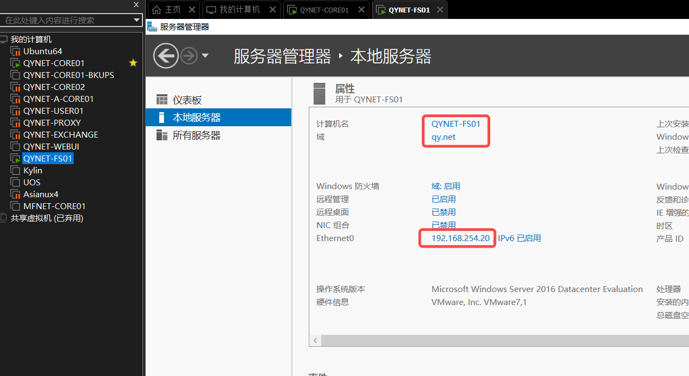

以下在 FS01 查询并记录真实结果：

```powershell
hostname
whoami

# DomainRole：3 是成员服务器，1 是成员工作站；4、5 是域控
Get-CimInstance Win32_ComputerSystem |
    Select-Object Name,Domain,PartOfDomain,DomainRole

Get-NetConnectionProfile |
    Select-Object InterfaceAlias,NetworkCategory

Get-Service LanmanServer |
    Select-Object Name,Status,StartType
```

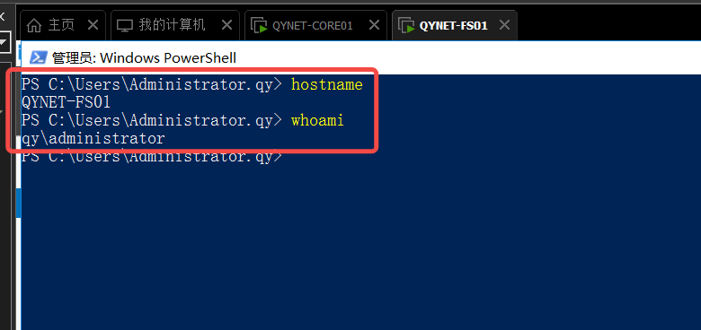

FS01 应属于 qy.net，域网络通常显示 DomainAuthenticated。分类异常时先查 DNS、域定位和安全通道，不要关闭防火墙绕过问题。

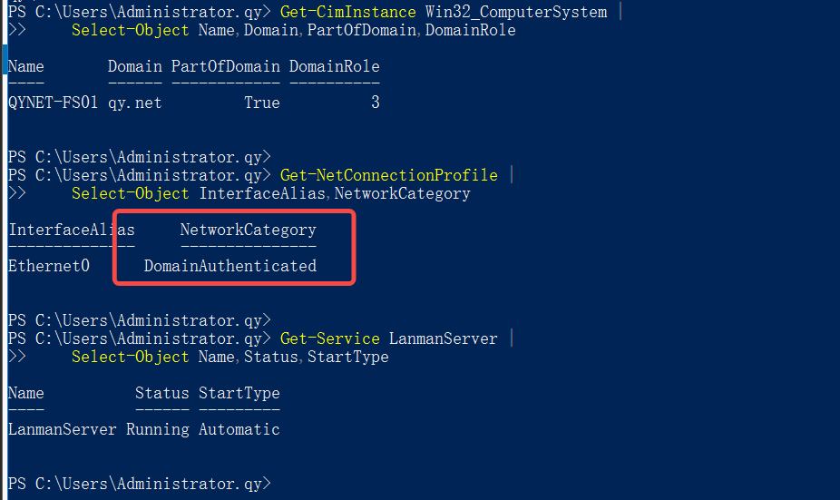

### 1.2 名称与目录

| 项目 | 名称 |
| --- | --- |
| 实验根 OU | OU=SharePermissions,DC=qy,DC=net |
| 用户 OU | OU=User,OU=SharePermissions,DC=qy,DC=net |
| 组 OU | OU=Group,OU=SharePermissions,DC=qy,DC=net |
| 只读用户 | lab_share_ro |
| 可修改用户 | lab_share_rw |
| 无权限用户 | lab_share_no |
| 全局安全组 | GG_LabShare_Read、GG_LabShare_Modify |
| 域本地安全组 | DL_LabShare_Read、DL_LabShare_Modify |
| 共享名 | LabShare |
| 本地数据目录 | C:\ADLab\SharePermissions\Data |
| 本地证据目录 | C:\ADLab\SharePermissions\Evidence |
| 客户端访问路径 | `\\QYNET-FS01.qy.net\LabShare` |

开始前检查名字与目录是否已有用途。重名时暂停并更换整套实验名称，**不覆盖已有对象或数据**。

## 二、设计权限：先分清方向

```text
lab_share_ro → GG_LabShare_Read   → DL_LabShare_Read   → 共享 Read   + NTFS ReadAndExecute
lab_share_rw → GG_LabShare_Modify → DL_LabShare_Modify → 共享 Change + NTFS Modify
lab_share_no → 不加入上述授权组  → 没有资源授权
```

AGDLP：账户（A）进入全局组（G），全局组进入域本地组（DL），再将资源权限（P）授予域本地组。

通过 SMB 访问需要同时通过共享权限和 NTFS 权限检查。权限可能来自多个组，不能只看某一个条目。本实验不设显式拒绝，也不给 Everyone／Users 额外放行。

| 对象 | 共享权限 | NTFS 权限 |
| --- | --- | --- |
| DL_LabShare_Read | Read | ReadAndExecute |
| DL_LabShare_Modify | Change | Modify |
| Domain Admins | Full，管理员维护入口 | 经本机 Administrators 的维护权限 |
| 本机 Administrators、SYSTEM | SYSTEM 无需共享授权 | FullControl |

Modify 不等于 FullControl，本实验不给普通用户更改 ACL 或取得所有权的常规授权。管理员不参与普通用户的权限验收。

## 三、创建 OU、用户与组

**执行位置：CORE01／CORE02 或安装了 AD 管理工具的管理端。GUI 与 PowerShell 二选一，不要重复创建。**

### 3.1 GUI 操作

1. 打开“Active Directory 用户和计算机”（`dsa.msc`）。
2. 在 qy.net 下新建 OU：SharePermissions，再在其中新建 User、Group 两个子 OU。
3. 在 User 子 OU 中创建三个普通用户：lab_share_ro、lab_share_rw、lab_share_no。
4. 分别设置符合域策略的密码，不添加管理员身份。本实验可暂不要求首次登录改密，避免干扰测试；不要设置密码永不过期来绕过管理。
5. 在 Group 子 OU 中创建四个组，类型均为“安全组”。GG 开头两组选择“全局”，DL 开头两组选择“域本地”。
6. ro 用户加入 GG_LabShare_Read；rw 用户加入 GG_LabShare_Modify。
7. GG_LabShare_Read 加入 DL_LabShare_Read；GG_LabShare_Modify 加入 DL_LabShare_Modify。
8. no 用户不加入上述组。

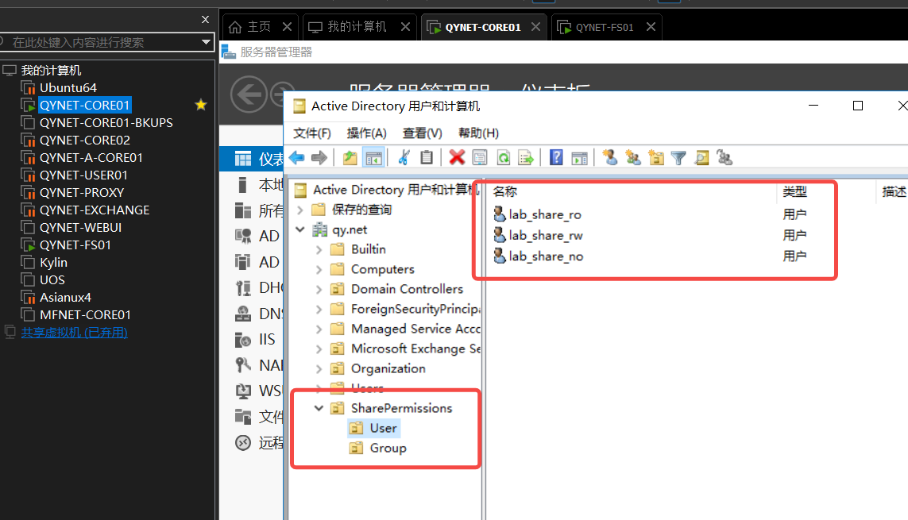
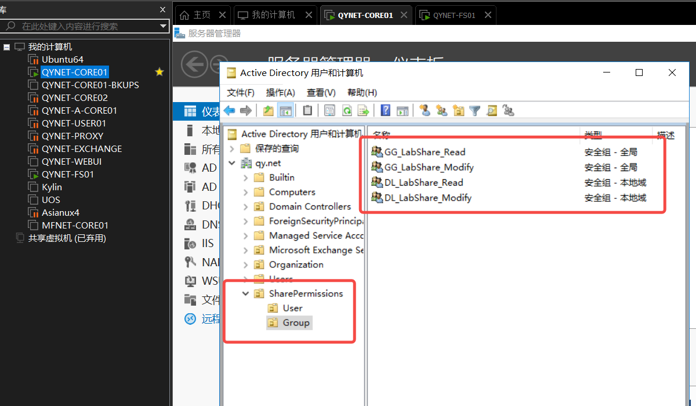
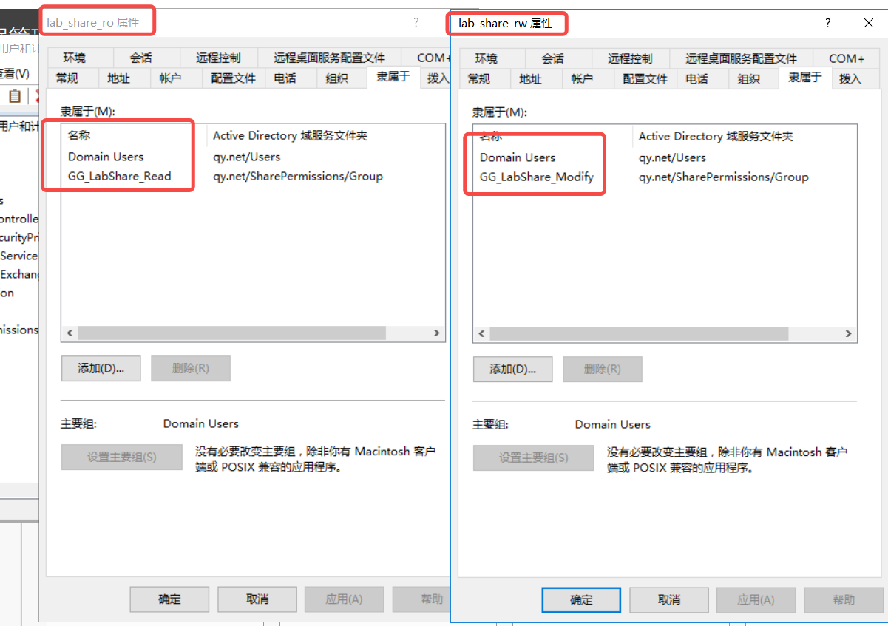
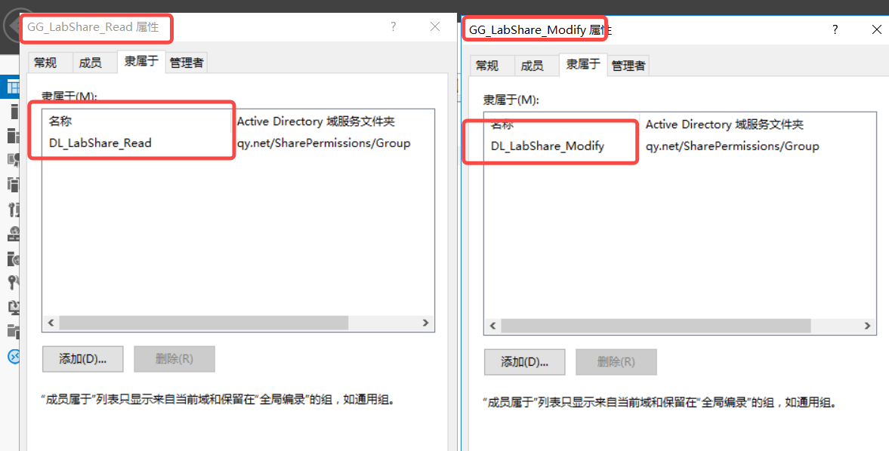

### 3.2 PowerShell 等价操作

在同一个管理端窗口执行：

```powershell
Import-Module ActiveDirectory
$domain = Get-ADDomain
if ($domain.DNSRoot -ne 'qy.net') { throw '当前连接的不是 qy.net。' }

$labOU = "OU=SharePermissions,$($domain.DistinguishedName)"
$userOU = "OU=User,$labOU"
$groupOU = "OU=Group,$labOU"
$groupNames = @(
    'GG_LabShare_Read'
    'GG_LabShare_Modify'
    'DL_LabShare_Read'
    'DL_LabShare_Modify'
)
$userNames = @('lab_share_ro','lab_share_rw','lab_share_no')

# 重名就停止，不覆盖未知的既有对象
if (Get-ADOrganizationalUnit -Filter 'Name -eq "SharePermissions"') {
    throw '同名 OU 已存在，请先确认。'
}
foreach ($name in ($groupNames + $userNames)) {
    if (Get-ADObject -Filter { sAMAccountName -eq $name }) {
        throw "账户名已存在：$name"
    }
}

New-ADOrganizationalUnit -Name 'SharePermissions' -Path $domain.DistinguishedName
New-ADOrganizationalUnit -Name 'User' -Path $labOU
New-ADOrganizationalUnit -Name 'Group' -Path $labOU

foreach ($name in $groupNames) {
    $scope = if ($name -like 'GG_*') { 'Global' } else { 'DomainLocal' }
    New-ADGroup -Name $name -SamAccountName $name -GroupScope $scope -GroupCategory Security -Path $groupOU
}

foreach ($name in $userNames) {
    # 安全输入，不把明文密码写进笔记
    $password = Read-Host "为 $name 输入实验密码" -AsSecureString
    $userParams = @{
        Name = $name
        SamAccountName = $name
        UserPrincipalName = "$name@$($domain.DNSRoot)"
        Path = $userOU
        AccountPassword = $password
        Enabled = $true
        ChangePasswordAtLogon = $false
    }
    New-ADUser @userParams
}

# 用户 → 全局组 → 域本地组
Add-ADGroupMember -Identity GG_LabShare_Read -Members lab_share_ro
Add-ADGroupMember -Identity GG_LabShare_Modify -Members lab_share_rw
Add-ADGroupMember -Identity DL_LabShare_Read -Members GG_LabShare_Read
Add-ADGroupMember -Identity DL_LabShare_Modify -Members GG_LabShare_Modify

Get-ADGroup -Filter * -SearchBase $labOU |
    Select-Object Name,GroupScope,GroupCategory

# 不递归：看直接成员，确认嵌套方向
Get-ADGroupMember -Identity DL_LabShare_Read |
    Select-Object Name,ObjectClass

# 递归：看展开后的成员，不能靠它还原完整嵌套路径
Get-ADGroupMember -Identity DL_LabShare_Read -Recursive |
    Select-Object Name,SamAccountName,ObjectClass
```

创建类命令可能成功时无输出。中途失败先检查哪些对象已创建，不要直接整段重跑或批量删除。也要用相同方式验证 Modify 组的嵌套关系。

## 四、创建目录与样本文件

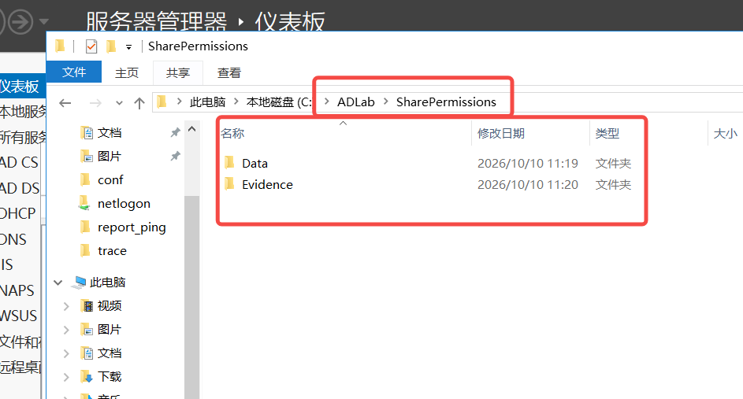
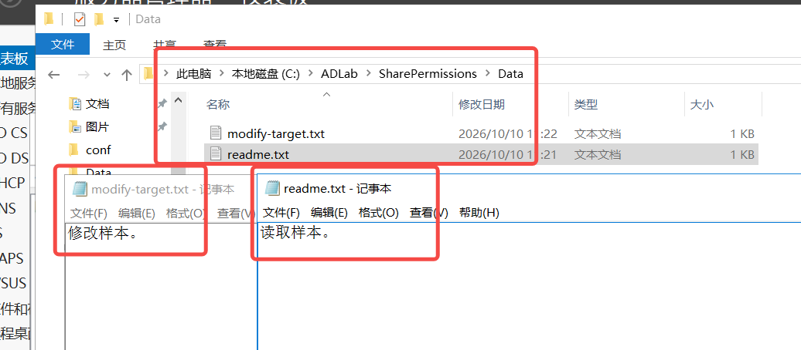

**执行位置：FS01，提升权限的 PowerShell（仅供参考）。**

```powershell
$labRoot = 'C:\ADLab\SharePermissions'
$labPath = Join-Path $labRoot 'Data'
$evidencePath = Join-Path $labRoot 'Evidence'

if (Test-Path -LiteralPath $labRoot) {
    throw '实验目录已存在，请先检查，不覆盖已有文件。'
}
if (Get-SmbShare -Name LabShare -ErrorAction SilentlyContinue) {
    throw '同名共享已存在，请先检查。'
}
New-Item -ItemType Directory -Path $labPath,$evidencePath

Set-Content -LiteralPath (Join-Path $labPath 'readme.txt') -Value '共享权限实训：读取样本。' -Encoding UTF8
Set-Content -LiteralPath (Join-Path $labPath 'modify-target.txt') -Value '共享权限实训：修改样本。' -Encoding UTF8

# 初始 DACL 保存到共享目录之外
(Get-Acl -LiteralPath $labPath).Sddl |
    Set-Content -LiteralPath (Join-Path $evidencePath 'data-before-acl.txt')
```

不要共享 Evidence；它是管理记录，不是普通用户的实验数据。

## 五、配置 NTFS 权限

### 5.1 GUI 操作（推荐先手动做一次）

在 FS01 打开 Data 的“属性 → 安全 → 高级”：

查看继承来源。

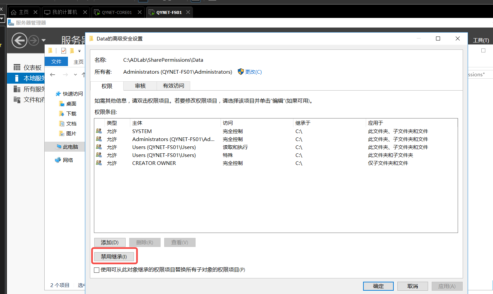

点击“禁用继承”，选择“将已继承的权限转换为此对象的显式权限”。

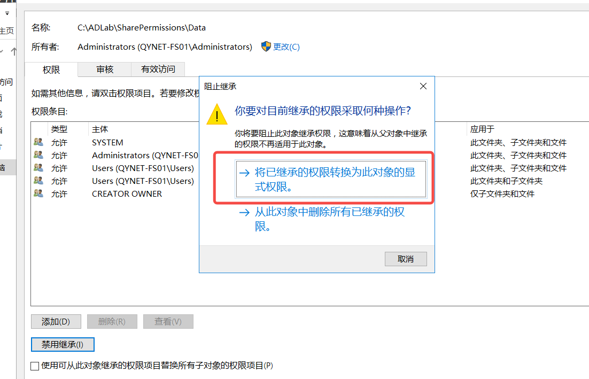

保留／补齐本机 Administrators、SYSTEM 的完全控制，应用于“此文件夹、子文件夹和文件”。

添加 `qy\DL_LabShare_Read`，允许“读取和执行、列出文件夹内容、读取”。

添加 `qy\DL_LabShare_Modify`，允许“修改”。

两个域组也应用于“此文件夹、子文件夹和文件”。

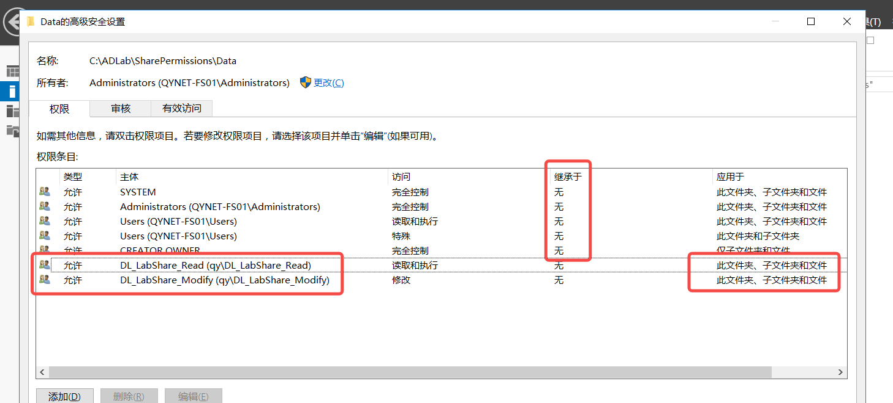

移除本实验不需要的 Users、Authenticated Users、Everyone 等宽泛授权，**不要删除维护账号**。

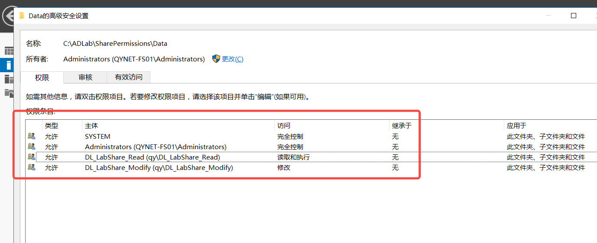

最终核对只有需要的维护与资源授权。

打开两个样本文件的安全页，确认继承到新权限，没有意外的独立授权。

### 5.2 PowerShell 等价操作（与 GUI 二选一）（仅供参考）

以下会替换新建 Data 目录的 DACL，**不能套用到业务目录或磁盘根目录**。

```powershell
$computer = Get-CimInstance Win32_ComputerSystem
if ($computer.Domain -ne 'qy.net' -or $computer.DomainRole -ge 4) {
    throw '应在 qy.net 的成员服务器执行，不在域控执行。'
}
$labPath = 'C:\ADLab\SharePermissions\Data'
if (-not (Test-Path -LiteralPath $labPath -PathType Container)) {
    throw '先完成实验目录创建。'
}

# 创建明确的 DACL，一次应用，保留管理员与系统的维护授权
$acl = [System.Security.AccessControl.DirectorySecurity]::new()
$acl.SetAccessRuleProtection($true, $false)
$entries = @(
    @{Identity = [System.Security.Principal.SecurityIdentifier]::new('S-1-5-18'); Rights = 'FullControl'}
    @{Identity = [System.Security.Principal.SecurityIdentifier]::new('S-1-5-32-544'); Rights = 'FullControl'}
    @{Identity = [System.Security.Principal.NTAccount]::new('qy\DL_LabShare_Read'); Rights = 'ReadAndExecute'}
    @{Identity = [System.Security.Principal.NTAccount]::new('qy\DL_LabShare_Modify'); Rights = 'Modify'}
)
foreach ($entry in $entries) {
    $rule = [System.Security.AccessControl.FileSystemAccessRule]::new(
        $entry.Identity,
        [System.Security.AccessControl.FileSystemRights]$entry.Rights,
        [System.Security.AccessControl.InheritanceFlags]'ContainerInherit,ObjectInherit',
        [System.Security.AccessControl.PropagationFlags]::None,
        [System.Security.AccessControl.AccessControlType]::Allow
    )
    $acl.AddAccessRule($rule)
}
Set-Acl -LiteralPath $labPath -AclObject $acl

(Get-Acl -LiteralPath $labPath).Access |
    Select-Object IdentityReference,FileSystemRights,AccessControlType,IsInherited
(Get-Acl -LiteralPath (Join-Path $labPath 'readme.txt')).Access |
    Select-Object IdentityReference,FileSystemRights,AccessControlType,IsInherited
```

两个 SID 分别是 SYSTEM、本机 Administrators，避免中英文系统内置组名称不同。域组仍需要正常解析；失败时先查域连接、DNS 与 AD 复制。

## 六、创建共享并配置共享权限

### 6.1 GUI 操作

Data 的“属性 → 共享 → 高级共享”：

1. 勾选“共享此文件夹”，共享名 LabShare。
2. 点击“权限”，移除 Everyone。
3. 添加 DL_LabShare_Read：允许“读取”。
4. 添加 DL_LabShare_Modify：允许“更改”和“读取”。
5. 添加 Domain Admins：允许“完全控制”，仅作管理员维护入口。
6. 保存后重新核对；不要把“共享”页和“安全”页混为一谈。
7. 本实验可在“缓存”中关闭脱机缓存，减少测试干扰。

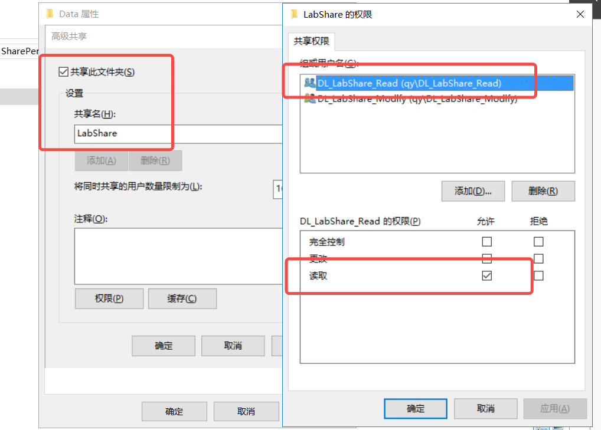
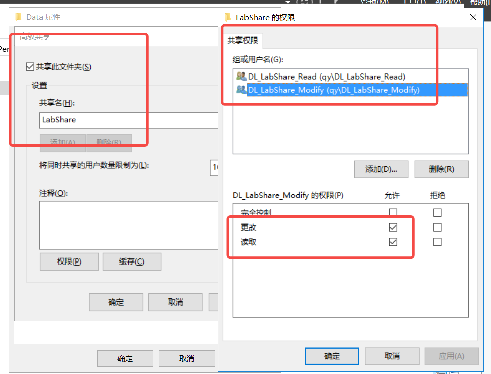
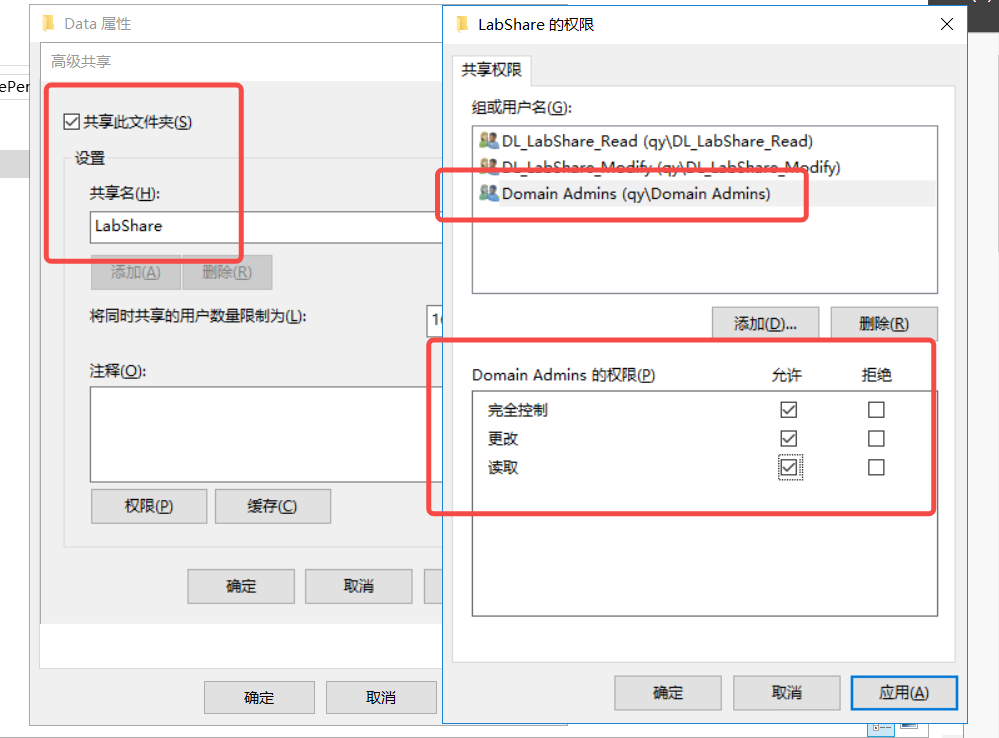

### 6.2 PowerShell 等价操作（仅供参考）

```powershell
# FS01 管理员窗口；NTFS 权限应已配置好
$shareParams = @{
    Name = 'LabShare'
    Path = 'C:\ADLab\SharePermissions\Data'
    ReadAccess = 'qy\DL_LabShare_Read'
    ChangeAccess = 'qy\DL_LabShare_Modify'
    FullAccess = 'qy\Domain Admins'
    CachingMode = 'None'
}
New-SmbShare @shareParams

Get-SmbShare -Name LabShare |
    Select-Object Name,Path,CachingMode
Get-SmbShareAccess -Name LabShare |
    Select-Object AccountName,AccessControlType,AccessRight
```

### 6.3 检查网络与防火墙

在 USER01：

```powershell
Resolve-DnsName QYNET-FS01.qy.net
Test-NetConnection QYNET-FS01.qy.net -Port 445
```

若 445 不通，在 FS01 查服务、网络分类和防火墙。确有需要时，仅对实验客户端开放，不关闭整个防火墙。

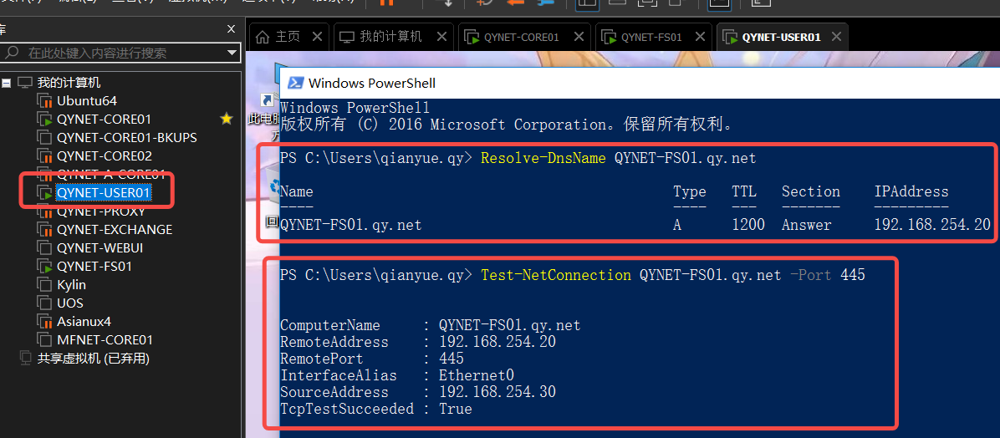

## 七、逐一验收三种身份

**执行位置：USER01 的 VM 控制台。每轮完整注销 Windows，再登录对应普通域用户；锁屏不算注销。**

不要用管理员凭据“帮忙打开”共享。每轮先执行：

```powershell
whoami
whoami /groups
$share = '\\QYNET-FS01.qy.net\LabShare'
Get-Content "$share\readme.txt"
```

whoami /groups 展示当前本地登录令牌，Get-Content 用于实际读取共享文件；两者都不能单独证明服务器接收的 SMB 会话身份。普通用户不需要为本次验收执行 Get-SmbConnection；若需核对会话身份，可在 FS01 管理员窗口使用第 9.4 节的 Get-SmbSession。

### 7.1 只读用户：qy\lab_share_ro

每条分别执行，保留实际报错：

```powershell
Get-ChildItem $share
Get-Content "$share\readme.txt"

# 写入类操作预期被拒绝
Set-Content "$share\ro-create.txt" -Value '只读用户尝试创建'
Add-Content "$share\modify-target.txt" -Value '只读用户尝试修改'
Remove-Item "$share\modify-target.txt" -Confirm
```

预期：可以浏览、读取，不能创建、修改、删除。删除测试仅针对实验样本；若意外成功，暂停并查授权，不继续删其他文件。

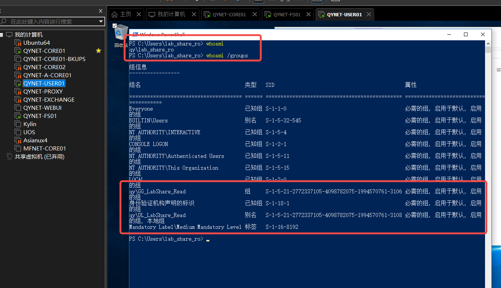
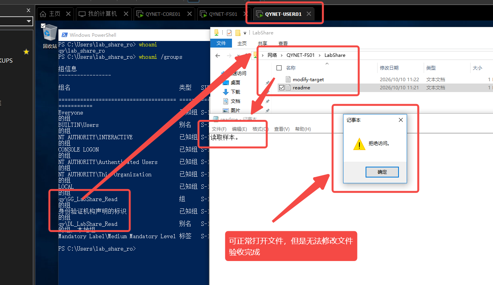

### 7.2 可修改用户：qy\lab_share_rw

注销切换后，重新执行身份检查，并设置变量（Powershell仅供参考）：

```powershell
$share = '\\QYNET-FS01.qy.net\LabShare'
Get-Content "$share\readme.txt"
Set-Content "$share\rw-create.txt" -Value '可修改用户创建文件'
Add-Content "$share\modify-target.txt" -Value '可修改用户追加内容'
Get-Content "$share\modify-target.txt"
Remove-Item "$share\rw-create.txt" -Confirm
```

文件资源管理器进行操作成功：

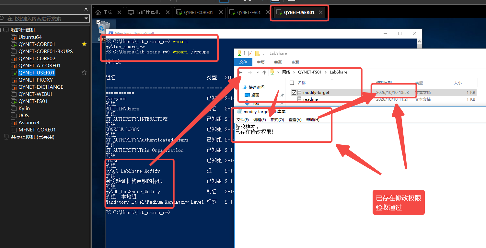

### 7.3 无权限用户：qy\lab_share_no

再次注销切换：

```powershell
$share = '\\QYNET-FS01.qy.net\LabShare'
whoami
Get-ChildItem $share
Get-Content "$share\readme.txt"
```

预期：能登录 USER01，但不能浏览和读取共享。**能登录域与拥有资源权限不是一回事。**

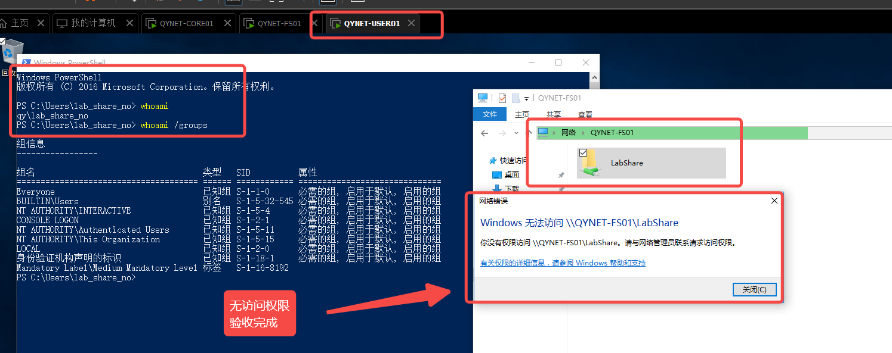

## 八、制造并排查“能读不能写”

基础验收通过后再做。

### 8.1 制造故障

在 FS01 的“高级共享 → 权限”：

1. 找到 DL_LabShare_Modify。
2. **取消允许“更改”，保留允许“读取”**，不添加拒绝。
3. NTFS 的 Modify 不变，保存并截图。
4. USER01 注销后重新登录 rw 用户，读 readme.txt，尝试创建 fault-test.txt。

预期：能读不能创建。使用新登录会话，避免旧 SMB 会话或文件句柄干扰即时观察。

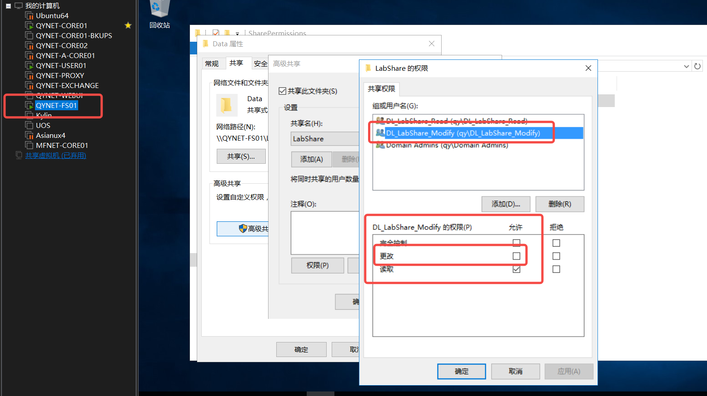

### 8.2 证据排查

先写判断，再查询；不要把全部命令敲在同一台机器：

```powershell
# USER01：当前登录身份与实际读取测试，与本次截图一致
whoami
Get-Content '\\QYNET-FS01.qy.net\LabShare\readme.txt'

# AD 管理端：嵌套关系
Get-ADGroupMember DL_LabShare_Modify
Get-ADGroupMember GG_LabShare_Modify

# FS01：两层权限
Get-SmbShareAccess -Name LabShare
(Get-Acl 'C:\ADLab\SharePermissions\Data').Access |
    Select-Object IdentityReference,FileSystemRights,AccessControlType,IsInherited
```

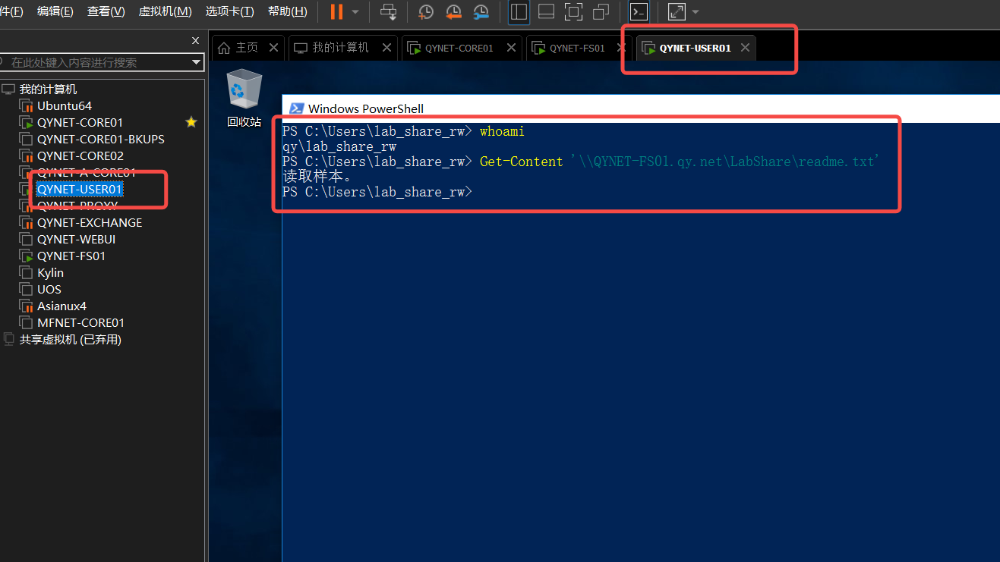
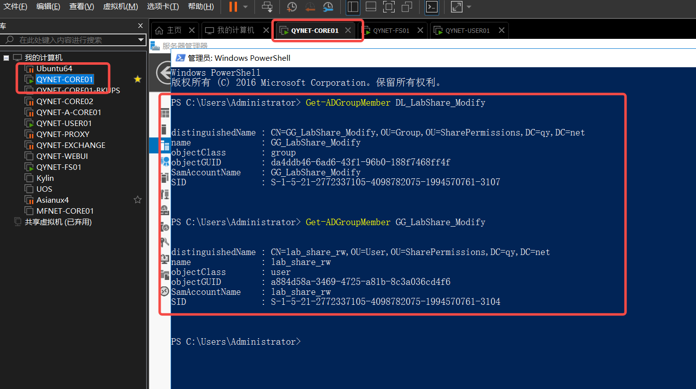
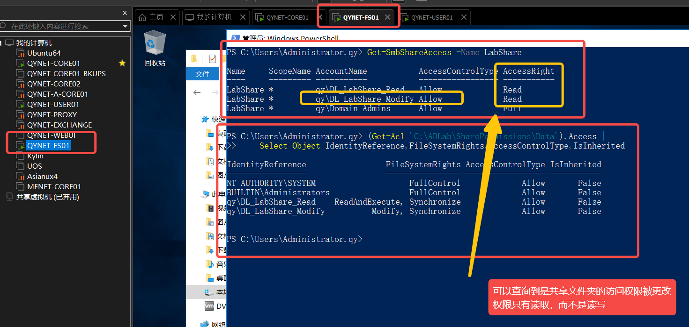

本题根因应是共享层（ACL）变成 Read。NTFS 允许 Modify，也不能越过共享层限制。

## 九、完成后回答

### 9.1 为什么用户放 Global，资源权限给 DomainLocal？

**答案：**这是 AGDLP 的职责分离：Global 组组织本域具有相同业务角色的用户，DomainLocal 组表示本域某项资源的授权。

例如用户进入 `GG_LabShare_Modify`，该组进入 `DL_LabShare_Modify`，再将共享 Change 与 NTFS Modify 授予 DL 组。人员变动时调整 GG 成员；资源授权变化时调整 DL 与 ACL，不必逐个修改文件夹上的用户权限。

这是一种便于维护的设计模式，不是说 Global 组技术上不能直接出现在 ACL 中。DomainLocal 是 AD 的“域本地组”，也不是 FS01 本机的本地组。[AD 安全组与作用域](https://learn.microsoft.com/en-us/windows-server/identity/ad-ds/manage/understand-security-groups)

### 9.2 NTFS Modify、共享 Read，远程能创建文件吗？本地直接访问 Data 呢？

**答案：**通过 `\\QYNET-FS01.qy.net\LabShare` 访问时，不能创建文件。共享层只允许 Read，即使 NTFS 层允许 Modify，也无法通过两层检查。

如果同一个用户可以登录 FS01，并直接通过本地路径 `C:\ADLab\SharePermissions\Data` 访问，则不经过 SMB 共享权限检查。在本实验没有其他拒绝或限制的前提下，其 NTFS Modify 允许创建、修改与删除。

这里的本地访问只是解释权限边界，不需要为了验证而额外授予实验用户登录服务器的权限。若在 FS01 上仍通过 UNC 路径访问共享，则仍会经过共享层。

### 9.3 为什么不用 Domain Admins 验收普通用户权限？

**答案：**本实验给 Domain Admins 配置了共享 Full，并通过服务器本机 Administrators 获得 NTFS 维护权限。管理员访问成功，不能证明普通用户的 AGDLP 授权正确。

必须用 ro、rw、no 三个普通账号分别测试，并核对实际 SMB 会话身份。管理员不是无条件绕过所有 ACL；问题在于它与普通用户获得的授权不同。

### 9.4 AD 组成员正确，为何还要核对 SMB 凭据？

**答案：**AD 成员关系说明目录中保存了什么，但当前 SMB 连接可能使用之前输入的另一套凭据，已有会话也可能尚未更新。桌面上登录的是 rw，不等于文件服务器一定以 rw 的身份处理访问。

在 USER01 普通用户窗口先用 `whoami` 核对登录身份；在 FS01 管理员窗口，用下面的查询检查服务器实际接收的会话：

```powershell
# 在 USER01 访问共享之后，于 FS01 的管理员 PowerShell 执行
Get-SmbSession |
    Select-Object ClientComputerName,ClientUserName,NumOpens
```

结合 USER01 的实际地址找到对应会话，核对 ClientUserName。没有查到会话不能直接证明“用户没有权限”，还要考虑连接失败、会话已关闭等情况。[Get-SmbSession](https://learn.microsoft.com/en-us/powershell/module/smbshare/get-smbsession)

本次 USER01 普通用户执行 Get-SmbConnection 遇到权限不足，不能据此判断共享配置失败，也不应为运行查询而换用管理员进行普通用户验收。

### 9.5 whoami /groups、klist、Get-SmbShareAccess、Get-Acl 各自证明哪一层？

| 查询 | 执行位置／身份 | 能看到什么 | 不能单独证明什么 |
| --- | --- | --- | --- |
| `whoami /groups` | USER01 当前测试用户 | 当前本地登录令牌中的组及其属性 | 不能单独证明 SMB 会话身份和资源最终权限 |
| `klist` | USER01 当前测试用户 | 当前登录会话缓存的 TGT、服务票据等 Kerberos 信息 | 有票据不等于 ACL 授权成功，也不能据此保证某个 SMB 会话实际使用了 Kerberos |
| `Get-SmbShareAccess -Name LabShare` | FS01 管理员 | LabShare 的共享 ACL，含 Allow／Deny、Read／Change／Full | 不显示文件及文件夹的 NTFS DACL |
| `Get-Acl 'C:\ADLab\SharePermissions\Data'` | FS01，使用可读取安全描述符的账号 | 本地 Data 的安全描述符；本实验通过 `.Access` 查看 NTFS DACL | 不显示共享 ACL，也不自动计算某个用户的最终有效权限 |

补充：`Get-SmbSession` 查看服务器端 SMB 会话身份。要得出访问结论，需要把身份、令牌／组、两层 ACL 与实际读写结果结合起来，而不是只看一条命令。

参考：[klist](https://learn.microsoft.com/en-us/windows-server/administration/windows-commands/klist)、[Get-SmbShareAccess](https://learn.microsoft.com/en-us/powershell/module/smbshare/get-smbshareaccess)、[Get-Acl](https://learn.microsoft.com/en-us/powershell/module/microsoft.powershell.security/get-acl)。

### 9.6 新加组后，为什么可能需要注销，而不只是 klist purge？

**答案：**AD 中修改了成员关系，不会立即重建用户已有的 Windows 登录令牌。`klist purge` 清除当前会话的 Kerberos 票据缓存，但不会刷新已经生成的本地登录令牌，也不保证所有已有 SMB 会话立即重新认证。

在本实验中，先等待相关 DC 的组成员变更复制到位，再完整注销并重新登录，是便于控制变量的办法。锁屏／解锁不等于重新登录，不需要把重启作为默认步骤。

某些纯网络访问场景可以通过重新获取票据并建立新连接更新认证信息，不是每次改组都必须重启。但若要验证 `whoami /groups` 的本地令牌变化，就不能仅靠 purge。若根因是共享 ACL 被改为 Read，清票据也不会把它变回 Change。

### 9.7 删除共享定义会删除磁盘文件吗？

**答案：**不会。`Remove-SmbShare -Name LabShare` 移除的是 SMB 共享定义，底层 Data 目录、文件和 NTFS 权限不会因此删除。

原来的 UNC 共享入口不再可用，但文件仍能通过本地路径访问。删除共享可能中断客户端访问并影响打开的文件，所以应先确认无人使用；不要把删除共享与删除文件夹混为一谈。[Remove-SmbShare](https://learn.microsoft.com/en-us/powershell/module/smbshare/remove-smbshare)

---

相关笔记：

- [组与成员](/posts/springtsuki/notes/windowsad/powershell/915-group/)
- [Kerberos 与票据](/posts/springtsuki/notes/windowsad/powershell/922-kerberos/)
- [备份与恢复实训](/posts/springtsuki/notes/windowsad/labs/backups/109-backups/)

参考：[Microsoft AD 安全组说明](https://learn.microsoft.com/en-us/windows-server/identity/ad-ds/manage/understand-security-groups)。
